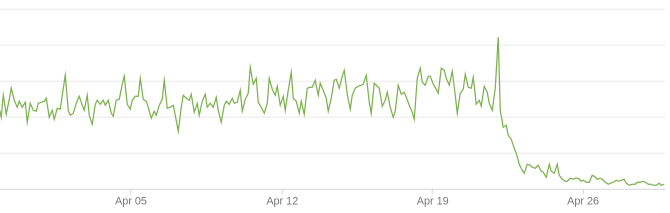

# Cloudflare Workers KV Cache

Use Cloudflare workers and KV to reduce trips back to origin.

This was developed as a simple caching mechanism for a website with more than 50,000 images of varying sizes, total size is approximately 20gb. Despite caching in the CDN there were still many requests which come through to origin due to not being cached in all edge locations.

The chart below shows bandwidth used before & after deploying this worker.

## Installation

- Setup a KV database: `IMAGE_CACHE`
- Add an environment variable `ORIGIN_URL` which points to your origin server, path will be appended to it eg. https://images.example.com/image/file.jpg will be mapped to ORIGIN_URL/image/file.jpg
- Deploy: I installed via the web interface though deploying using wrangler is also simple.
